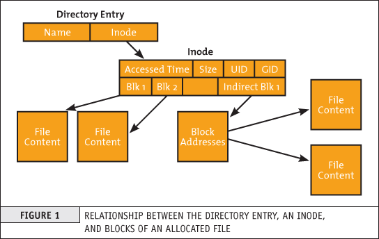
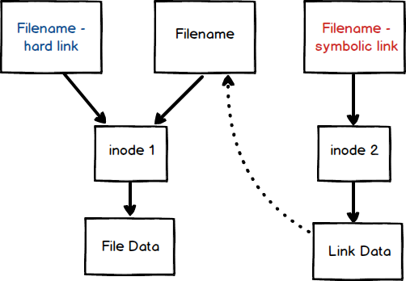

#### 파일 시스템
- 기본적으로 리눅스는 Tree 형태의 계층 구조를 가진다.

> [Ubuntu Main Directories](https://help.ubuntu.com/community/LinuxFilesystemTreeOverview#Main_directories)

#### 파일의 종류

### Main Directories

- /bin, /sbin
  - 터미널에서 여러 커맨드를 사용할 수 있는 디렉터리
  - sbin은 관리자 권한으로 실행할 수 있는 bin 디렉터리
- /lib
  - 매우 중요한 동적 라이브러리와 커널 모듈이 포함되어 있습니다.
- /usr
  - 사용자가 추가한 유틸리티 및 애플리케이션을 포함한 디렉토리 이며, /usr/bin 및 /usr/lib을 포함할 수 있다.
  - /usr/bin 및 /usr/lib 은 루트 디렉터리의 역할과 비슷하게 따라간다.
- /home
  - 사용자 홈 디렉토리
- /etc
  - 시스템의 설정파일이 들어간다. 설정파일을 수정하는 것이기 때문에 리눅스 전체에 영향을 끼칠 수 있다.
- /mnt
  - 일시적으로 파일 시스템에서 마운트하는 경우 사용하는 디렉터리
- /proc, /sys
- /tmp
  - 애플리케이션에 의해 사용되는 임시 파일을 저장하는 디렉터리
- /dev
  - 디바이스 드라이버가 사용하는 디바이스 파일 디렉터리
- /var

## 2. i-node (index-node)
 

- 아이노드는 리눅스 파일 및 디렉터리에 대한 메타데이터정보를 가진 데이터이다.
  - `ls -ali` 명령어를 통해서 파일에 대한 다양한 메타데이터 정보를 확인할 수 있는데, 이 정보들이 아이노드에 저장되어 있다.
- 위 그림을 통해서 알 수 있듯이 하나의 파일이나 디렉터리는 `이름 + 아이노드 + 내용`으로 구성되어 있다.
  - 때문에 파일 이름을 통해서 파일 내용을 확인하려 할때 아이노드를 통해서 확인할 수 있으며, 일종의 인덱스와 같은 역할을 한다.

#### 2.1. 하드링크(Hard Link)와 심볼릭 링크(Symbolic Link)

- 리눅스에서 링크의 개념은 윈도우의 바로가기와 매우 유사한 개념을 가지고 있다. 때문에 원본 파일이 링크가 걸려 있는 파일은 읽으면 동일한 내용을 확인할 수 있으며, 수정을 하여도 동일한 내용을 확인할 수 있다.

 

1. 하드링크(Hard Link)
- 하드링크는 원본 파일과 동일한 아이노드를 바라보고 있다는 것이 큰 특징이다.
- 때문에 원본 파일을 삭제하거나 디렉터리를 변경하여도 하드 링크가 걸려 있는 파일은 원본 파일의 아이노드를 가르키고 있기 때문에 내용이 유지 된다.

`ln TARGET LINK_NAME`

1. 심볼릭 링크(Symbolic Link)
- 심볼릭 링크는 원본 파일 또는 디렉토리에 대한 이름을 가르키는 링크 데이터를 가지게 되며, 심볼릭 링크와 원본 파일의 아이노드가 서로 다르다는 특징을 가지고 있다.
  - 심볼릭 링크 파일 -> 심볼릭 링크의 아이노드 -> 링크 데이터 -> 원본 파일 이름 -> 원본 파일 아이노드 -> 원본 파일 내용
- 심볼릭 링크는 원본 파일과 다른 아이노드르 가지며, 링크데이터는 원본 파일의 이름을 가르키기 때문에 원본 파일의 이름 변경, 삭제, 디렉터리의 변경으로 인해서 링크가 끊길 수 있다.

`ln -s TARGET LINK_NAME`

### 파일 관련 커맨드
- ls
- touch
  - 빈 파일을 만드는 명령어
- rm
  - 파일을 삭제하는 명령어
  - rm 명령어를 통해서 디렉터리 삭제도 가능하다.
  - rm 명령어 사용 시 파일을 완전히 삭제하기 때문에 주의해야한다.
- mv
  - 파일 및 디렉터리의 이름을 변경할 수 있지만, 위치도 변경이 가능한 명령어
- mkdir
  - 디렉터리를 생성하기위한 명령어
- rmdir
  - 디렉터리를 삭제하기위한 명령어
- ln
  - 링크를 만드는 명령어
- stat

