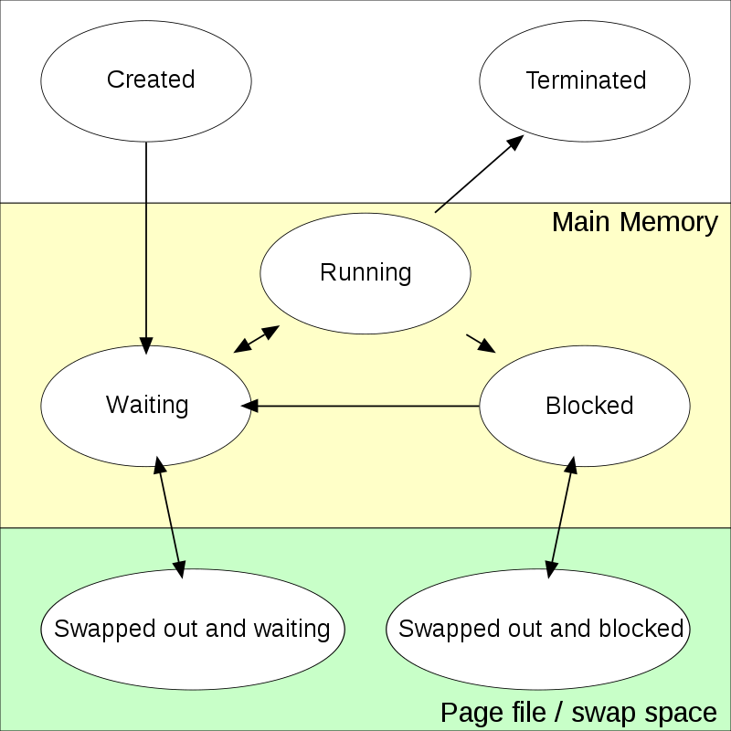

- 리눅스 운영체제는 프로세스에게 자원을 할당하고 관리한다.

### 프로세스 스케쥴링(Process Scheduling)
- CPU가 여러 프로세스를 실행할때, 하나의 프로세스만 지속적으로 실행시키지 않고 여러 프로세스를 돌아가면서 실행시키기 위한 것이다.
- 애플리케이션의 특성에 따라 CPU를 지속적으로 많이 소모하거나, 사용자의 요청에 따라서만 소모하면 되는 것이냐의 특성에 따라서 프로세스 스케쥴링이 되어야지 좋은 성능을 발휘할 수 있다.
- CPU가 많을 수록 하나의 컴퓨터의 여러 프로세스를 동시에 처리할 수 있다. (멀티코어 CPU), 단일CPU 사용시에는 코어클락이 좋을 수록 더 성능이 좋았다.
- 단일CPU 사용시에는 코어클락이 높을 수록 좋지만 너무 높아지면 열이 발생하여 냉각기가 필요하다. 때문에 멀티코어 CPU를 활용하였지만

### 프로세스 상태 (Process State)
- 프로세스는 상태를 가지고 있어야지 CPU가 프로세스를 스케쥴링하여 어떤 프로세스를 실행할지 선택할 수 있다. 

> https://en.wikipedia.org/wiki/Process_state

### 프로세스 계층구조
- 서로다른 프로세스면 PID가 서로 다르다.
- 부모 프로세스와 자식 프로세스가 존재한다. 모든 프로세스는 부모 프로세스가 존재한다. init 프로세스는 부모 프로세스가 존재하지 않는다.
- init 프로세스, PID 1번
- 프로세스 종료 처리와 프로세스 계층구조는 서로 관련이 있다.
  - 자식 프로세스가 종료되면 부모 프로세스가 종료 처리를 한다.
- 고아 프로세스
  - 부모프로세스가 먼저 죽게되면, 자식 프로세스는 init을 부모 프로세스로 가지게 된다.
  - 부모프로세스가 종료되면서 init 프로세스를 부모 프로세스로 연겨하기 전까지 일식적으로 고아 프로세스가 된다.
- 좀비 프로세스
  - 자식 프로세스가 종료되면 부모 프로세스가 종료 처리를 한다.
  - 자식 프로세스가 종료되었을 때, 부모 프로세스가 자식 프로세의 종료처리를 못하는 경우가 있다.
  - 때문에 자식 프로세스가 종료되기를 기다리지고 있는데 종료되지 않는다. 때문에 리눅스 시스템상에 남아있기 때문에 운영체제의 자원을 지속적으로 사용하는 문제가 발생할 수 있다.

### 프로세스의 종료 상태
- 프로세스의 동작이 끝날때 부모 프로세스에게 자신의 종료 상태를 알려준다.
- 프로세스가 종료될 때 넘겨주는 정보이다.
- 0은 성공을 의미하고 0이 아닌 다른 값은 실패를 의미한다.
- 