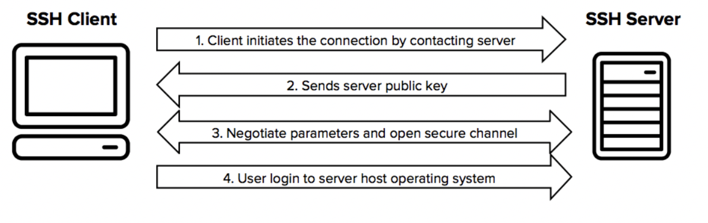

### SSH (Secure Shell)란?
---

- ***원격 호스트에 접속하기 위해 사용되는 보안 프로토콜***이다.
- 원격 호스트에 접속을 하기는 하는데 일반적인 GUI화면이 아닌 Shell로 원격 호스트를 제어한다.
  > Shell이란 검은화면에 흰색 글자를 입력하는 CLI(Command Line Interface)를 생각하면 된다.
- 강력한 암호화 방식으로 연결되어 있기 때문에 ***데이터를 중간에 가로채도 해석할 수 없는 암호화된 문자만이 노출***된다.
  - HTTP와 HTTPS의 차이와 비슷하다.  


### SSH 인증 방식
---

#### Password 인증 방식
- client에서 server로 접속할 때 비밀번호를 입력해서 인증하는 방식이다.
  - 비밀번호가 네트워크를 통해서 교환되는 문제점이 있으며, `Brute-force Attack (무차별 대입공격)`에 의하여 뚫릴 수 있는 위험이 있다.

#### 공개키 인증 방식
- client가 공개키와 개인키를 한 쌍을 생성하고, client의 공개키를 server의 host 인가 목록에 추가하여 인증하는 방식이다.
- 해당 기능 사용 시 비밀번호 없이도 원격 서버에 접속이 가능하다.
- 또한 Password 인증 방식에 비해 강력한 암호를 제공하기 때문에 추천하는 방식이다.
  
#### 공개키 인증 방식 과정 설명



1. client가 공개키와 개인키를 만든다.
  - `ssh-keygen 명령어`
2. server에게 공개키를 보낸뒤 인가 목록에 추가한다.
  - `.ssh/authorized_keys`
3. server는 자신의 공개키를 클라이언트에게 전송하고 client는 서버로부터 받은 공개키를 로컬에 저장한다.
  - `.ssh/known_hosts`
4. client는 server가 정상적인 서버인지 확인하는 작업을 진행한 이후, 암호화된 통신을 위한 세션키(대칭키)를 생성한다.
   - 세션키는 대칭키로 모든 통신을 암호화한다.
   - 대칭키는 비대칭키에 암복호화 과정이 빠르지만, 대칭키가 유출되었을 때 모든 통신을 복호화할 수 있는 단점이 있다.
   - 이를 해결하기 위해 클라이언트와 서버는 키 교환 알고리즘을 통해 안전하게 대칭키를 공유한다. 
5. 세션키를 통해 클라이언트와 서버는 안전한 네트워크 통신을 수행할 수 있다.

> https://www.ssh.com/academy/ssh
> https://limvo.tistory.com/21

### SSH 접속해보기
---

#### 환경 설정

1. Dockerfile을 이용하여 ubunutu 서버 구축
```Dockerfile
FROM ubuntu:20.04


### ssh 사용하기 위하여 openssh-server 설치
RUN apt-get update && \
    apt-get install -y vim openssh-server net-tools

RUN mkdir ~/.ssh

## rsa 형식, ~/.ssh에 키 이름 = id_rsa, 비밀번호 공백 
## id_rsa.pub 출력 스트림을 authorized_keys에 삽입
RUN ssh-keygen -m PEM -t rsa -f ~/.ssh/id_rsa -N "" && \
    cat ~/.ssh/id_rsa.pub > ~/.ssh/authorized_keys


EXPOSE 22
```

2. Docker image build 및 container 생성
```bash
## Dockerfile을 통한 이미지 빌드
docker build -t [image id] .

## --privileged : 도커 컨테이너를 privileged 모드로 실행
## /usr/sbin/init : init 스크립트 실행
## -p 2222:22 : 도커 서버 22번 포트를 호스트 PC에 2222으로 매핑
docker run --privileged --name [container id] -p 2222:22 -d [image id] /usr/sbin/init

## docker container 접속
docker exec -it [container id] bin/bash

## ssh 서비스 확인
systemctl status sshd
netstat -tnlp | grep 22
```


#### 1. docker ubuntu 서버 프라이빗 키를 이용해 접속

```bash
## docker 서버 접속 이후 ~/.ssh/id_rsa 파일 확인
docker exec -it [container id] bin/bash
cat ~/.ssh/id_rsa

## 원격 서버 private key를 호스트 PC에 저장
ssh -i [원격 서버 private key] -p 2222 root@localhost
```

 - 도커 우분투 서버 22번 포트를 호스트 PC에 2222으로 매핑했기 때문에 -p 옵션을 통해서 2222으로 접속
   - 옵션을 주지 않으면 22번 포트를 통해서 원격 서버에 접속을 할 수 있다.

#### 2. 호스트 pc 프라이빗 키를 이용해 접속

```bash
## 호스트 PC 키 생성
ssh-keygen -m PEM -t rsa -f ~/.ssh/id_rsa -N ""
## 원격 서버로 호스트 PC 공개키 전송
scp -i [원격 서버 private key] -P 2222 ~/.ssh/id_rsa.pub root@localhost:/root

## 원격 서버 접속하여 호스트 PC 공개키 authorized_keys에 삽입  
ssh -i [원격 서버 private key] -p 2222 root@localhost
cat id_rsa.pub >> .ssh/authorized_keys

## 원격 서버 private key 없이 접속 확인
ssh -p 2222 root@localhost
```


https://opentutorials.org/module/432/3742

https://www.lesstif.com/software-architect/ssh-load-key-invalid-format-openssh-rsa-106856464.html

> ssh-keygen 관련 옵션 : https://ydeer.tistory.com/298